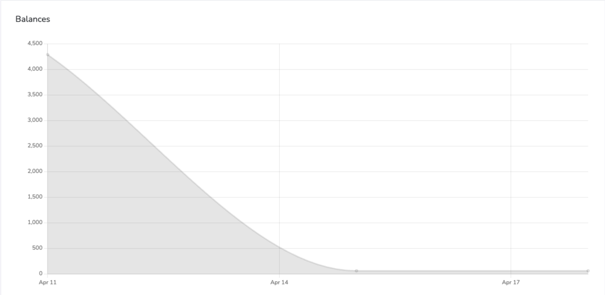

# Viewing Token Balances

!!! example "This page is for advanced users."

Use the block explorer to view the list of token balances at an address.

1. Retrieve the address whose tokens you want to view.
2. Open the [block explorer](./index.md) for the appropriate network. [The block explorer dashboard](./user-interface.md) is displayed.
3. Insert the address from Step 1 into the **Search** field. If the address exists, it is highlighted in the results list.
4. Click the highlighted address. The **Address Details** page is displayed.
5. Click the **Tokens** tab, as shown in the following image:

    <figure markdown>
    { loading=lazy .allow-zoom}
    <figcaption>Tokens.</figcaption>
    </figure>

   The address's `$FLR` balance and a list of the non-native tokens it contains are displayed. The list can include ERC-20, ERC-721, and ERC-1155 tokens.

## Balance History

Use the block explorer to view a historical chart of the native-token balance at the address.

1. Retrieve the address whose tokens you want to view.
2. Open the [block explorer](./index.md) for the network appropriate network.
   [The block explorer dashboard](./user-interface.md) is displayed.
3. Insert the address from Step 1 into the **Search** field.
   If the address exists, it is highlighted in the results list.
4. Click the highlighted address. The **Address Details** page is displayed.
5. Click the **Coin Balance History** tab, as shown in the following image:

    <figure markdown>
    { loading=lazy .allow-zoom}
    <figcaption>Coin Balance History.</figcaption>
    </figure>

    A chart that shows the history of the native token at the address and a list of associated blocks is displayed, as shown in the following image:

    <figure markdown>
    { loading=lazy .allow-zoom}
    <figcaption>Coin Balance Chart.</figcaption>
    </figure>
